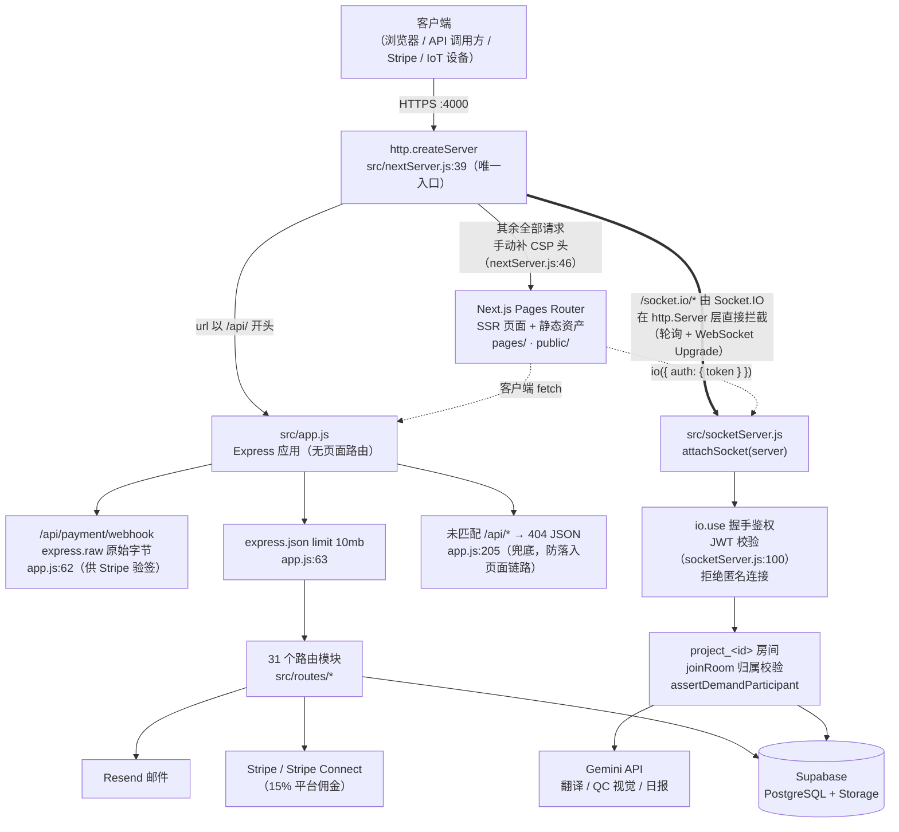
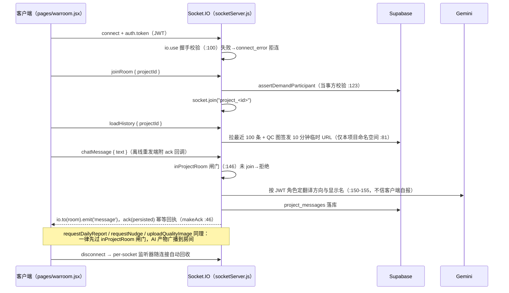

# TalEngineer 架构宪法（ARCHITECTURE.md）

> **文档定位**：本文档是所有 AI 协作与人工开发的**全局约束（System Prompt 级）**。
> 任何改动若与本文档冲突，必须先修订本文档并说明理由，再改代码。
> 每条约束都锚定了真实代码位置（`file:line`），修改对应代码时必须同步维护锚点。

---

## 1. 单入口双分流拓扑（Single Entry & Bifold Shunting）

**全站只有一个进程、一个端口、一个入口：`src/nextServer.js`。** legacy 双入口（`src/server.js`）已于 P3 治理中退役，严禁复活第二入口。

### 分流规则（锚定 `src/nextServer.js:39-48`）

| 请求形态 | 归属 | 说明 |
|---|---|---|
| `/socket.io/*`（轮询与 WS Upgrade） | Socket.IO | `attachSocket(server)`（`nextServer.js:51`）在 http.Server 层拦截，**不经过** createServer 回调；回调里的 `/socket.io/` 分支仅是防御性兜底 |
| `/api/*` | Express（`src/app.js`） | 安全中间件（helmet/CORS/限流）、31 个路由模块；未匹配路径由 `app.js:205` 返回 404 JSON |
| 其余全部 | Next.js Pages Router | 页面链路绕过 Express 中间件链，因此 CSP 头在 `nextServer.js:46` 手动补齐，**必须与 helmet 侧同源同值**（`src/config/csp.js` 单一来源） |

### 拓扑铁律

1. **禁止新增第二 HTTP 入口 / 第二端口 / 独立子进程服务**。新能力一律挂到现有分流之下。
2. **Express 层禁止新增任何页面路由**（`sendFile` / SSR / HTML 响应）。页面只属于 Next.js；`src/app.js` 只服务 `/api/*` 与静态资源中间件。
3. **`/api/*` 的响应必须永远是 JSON**——`app.js:205` 的 404 兜底存在的意义就是防止 API 未命中时漏到页面链路返回 200 HTML。
4. **CSP 双链路单一来源**：改 CSP 只能改 `src/config/csp.js`，严禁在两条链路各写一份（会重演历史上的配置漂移事故）。
5. **优雅关闭不可破坏**（`nextServer.js:63-76`）：SIGTERM → 先 `io.close()` 断长连接 → `server.close()` 排空在途请求 → 10 秒兜底强退。新增常驻资源（定时器、连接池）必须挂进该 shutdown 流程。

---

## 2. 状态隔离与实时通信约束（Socket.IO & Express Coexistence）

### 2.1 WarRoom 事件生命周期（锚定 `src/socketServer.js`）

事件清单（服务端）：`joinRoom`、`chatMessage`、`loadHistory`、`requestDailyReport`、`requestNudge`、`uploadQualityImage`、`disconnect`；下行：`message`、`history`、`messageError`。

### 2.2 硬红线

- **🔴 红线 S1 — 监听器生命周期**：所有 `socket.on(...)` 只允许注册在 `io.on('connection')` 回调内的 **per-socket 作用域**（随 disconnect 自动回收）。**严禁**在 Express 路由处理器、任何请求作用域或 socket 事件处理器内部注册 `io.on` / `process.on` / 全局 EventEmitter 监听器——那是每请求泄漏一个监听器的内存泄漏源。需要跨模块广播时，只允许使用已挂载的 `global.io`（`nextServer.js:52`，如 IoT 告警 `src/routes/iot.js`）做**发送**，不做监听。
- **🔴 红线 S2 — 长连接零信任、零状态**：Socket 连接自身**不承载任何业务真相**。身份**与显示名**只来自握手 JWT（`socket.user` / `displayNameOf` `:56`，绝不使用客户端自报的 senderName）；房间归属每次经 `assertDemandParticipant` 从 Supabase 现查；聊天记录、QC 图一律落 `project_messages` / Storage 持久层。**严禁**用模块级 Map/数组在内存里缓存会话状态、房间成员或消息——进程重启（Railway 每次部署必然发生）后可恢复的唯一依据是持久层。
- 每个业务事件必须先过 `inProjectRoom` 闸门（`joinRoom` 是唯一入闸口）；只读的 `loadHistory` 例外地直接做归属校验以规避 join 竞态（`:295-297` 有注释说明）——新增只读事件可沿用该模式，新增**写**事件必须走闸门。
- ack 回调必须幂等：一律使用 `makeAck`（`:46`），保证正常路径与 catch 路径不会双重回执，禁止手写第二份守卫。
- CORS 白名单只能通过 `ALLOWED_ORIGINS` 环境变量扩展，且解析唯一来源是 `src/config/origins.js`（REST 与 socket 共用），**严禁**回退到 `origin: '*'`（历史 P2 漏洞）。

---

## 3. 外部契约与回调防线（Stripe Webhooks & Resend Contract）

### 3.1 Stripe Webhook 防线（锚定 `src/routes/payment.js:299` + `src/app.js:62`）

当前实现即为标准，任何新回调端点必须复刻这套链条：

1. **原始字节验签**：webhook 路径在 `express.json` **之前**用 `express.raw` 单独挂载（`app.js:62`），`stripe.webhooks.constructEvent(req.body, sig, secret)` 对原始 Buffer 验签。JSON 化之后的 body 无法验签——挂载顺序就是安全边界。
2. **fail-closed 三态**：缺 `STRIPE_WEBHOOK_SECRET` → 503（让 Stripe 重试，绝不静默吞事件）；验签失败 → 400；落库失败 → 500（让 Stripe 重试，避免"已收款但状态未更新"）。
3. **🔴 红线 W1 — 事件内容零信任**：验签只证明"是 Stripe 发的"，**不证明 metadata 语义可信**。业务归属一律以 DB 现查为准——该纪律已固化为唯一实现 `src/services/settlementService.js`（P1 治理）：`metadata.milestone_id` 只当索引线索，`demand_id` 从条件更新的返回行取真实值，绝不直接消费 `metadata.demand_id`。所有入账结算（webhook / confirm-funding）必须调用 `settleMilestoneFunding`，严禁再内联实现。
4. **幂等 + 状态机**：入账走条件更新（`.in('status', ['locked','payment_failed'])`），0 行更新说明重复事件或非法状态——告警并跳过后续副作用（防重复发信），不报错给 Stripe。
5. 副作用（企业 webhook 转发、通知）一律 fire-and-forget 惰性 require，**绝不影响入账主流程**（`settlementService.js` 通知段）。
6. **webhook 豁免 IP 限流**（`app.js` apiLimiter 的 skip 函数）：验签是它的门禁，限流只会在 Stripe 重试风暴时延迟入账——不得移除该豁免，也不得给 webhook 路径新增基于 IP 的门槛。

### 3.2 Resend 邮件契约（锚定 `src/config/email.js`）

- 所有外发邮件必须经过 `sendOutreachEmail` / `src/services/email.js` 的封装，**严禁**在路由里直接 new Resend 客户端。
- 无 `RESEND_API_KEY` 时必须保持"仅日志模拟、不发送"的降级行为（本地开发与 CI 依赖它）。
- 发件人只能来自 `EMAIL_FROM` 环境变量；发信失败对注册/重置等主流程必须是 fire-and-forget（参照 `auth.js` 注释：发信失败不阻断注册）。
- 对外 webhook 派发（`src/services/webhookService.js`）已实现 HMAC 签名 + "无 secret 不发送"，新增出站回调沿用此契约。

### 3.3 🔴 红线 W2 — 裸 `req.body` 禁令

**任何新增或被触碰的 Express 端点，`req.body` 必须先过 Zod schema 再消费**（现行范式见 `src/routes/auth.js:18` 的 `registerSchema`，zod 已在 7 个路由模块 + 工具注册表落地）。具体规则：

- 校验失败一律 400 + 明确错误信息，禁止把未校验字段透传给 SQL/Storage/Stripe 调用。
- 归属类字段（`demand_id`、`milestone_id` 等）除了形状校验，还必须做 DB 归属比对（参照 `payment.js:64` fund-milestone 的 `demand_id` 一致性检查）——**Zod 管形状，DB 管归属，两道都不能省**。
- 异步回调（Stripe webhook、IoT 上报、企业 API）是伪造重灾区：验签/API key 鉴权（`requireApiKey`）在前，Zod 校验在后，二者缺一不可。
- 存量未上 Zod 的路由不要求一次性回补，但**改到哪个补到哪个**（童子军军规）。

---

## 4. 日志 PII 规范（P3 确立）

- **🔴 红线 P1 — 严禁明文打印用户隐私字段**：邮箱、姓名、电话及任何可定位到自然人的字段，落日志前**必须**经 `maskEmail`（`src/services/referralService.js:280`，恒留 ≥1 位不打码）或等价脱敏处理。密码、token、API key **任何形态都不得出现在日志中**（含出错时的对象 dump）。
- 强制复用，禁止新造：脱敏一律 `require` 现有 `maskEmail`，不允许各模块手写第二份打码逻辑（防实现漂移出"打码但仍泄露"的变体，见该函数注释里的 1-2 位本地部分陷阱）。
- 现行合规基线（P3 已改造）：`src/routes/auth.js` 4 处、`src/services/matchmakerService.js` 1 处，日志形如 `[Auth] Password reset for di***@gmail.com`——新代码照此格式。
- ~~已知存量欠账~~（P1 已清偿）：`src/config/email.js` 3 处收件人邮箱日志已全部接入 `maskEmail`。
- 错误处理日志用 `console.error`（已接 Sentry，`instrument.js`）；对客户端的错误响应必须脱敏为通用文案，内部细节只进日志/Sentry（既有全局错误处理器约定，`src/app.js:210` 起有完整注释）。
- 运营/审计日志（`[Auth]`、`[Payment]`、`[Matchmaker]` 等带标签前缀的 console.log）是**有意保留的 Evidence 链**，不是调试噪音；但其中的 PII 字段同样受本红线约束。

---

## 附：修改守则速查

| 你要改… | 必须遵守 |
|---|---|
| 新增 API 端点 | 挂在 `src/routes/*` → Zod 校验 body → JSON 响应 → 归属做 DB 比对 |
| 新增页面 | 只放 `pages/`，严禁碰 Express |
| 新增 Socket 事件 | 写事件过 `inProjectRoom` 闸门；监听器只在 per-socket 作用域；状态进 Supabase |
| 新增外部回调 | 验签/鉴权 → raw body（若需验签）→ Zod → fail-closed 响应码 |
| 打日志 | PII 过 `maskEmail`；错误用 console.error；密钥/token 永不落日志 |
| 改 CSP / CORS | 只改 `src/config/csp.js` / `ALLOWED_ORIGINS` 环境变量 |
| 改支付逻辑 | 先在 Stripe 测试模式验证；状态机条件更新；幂等优先 |
