# TalEngineer 用户使用手册 v1.0

> **认证过的工业自动化工程师，托管付款，随需交付。**
> 工厂要找会 PLC、机器人、机器视觉、电气的工程师，靠猎头太慢、靠自由市场不敢信。TalEngineer 用平台考证解决"这人行不行"，用资金托管解决"钱给了怕打水漂"，把跨境用人变成一件可控的事。
>
> 官网：**https://talengineer.us** · 当前为 Beta 测试期

---

## 一、TalEngineer 是什么

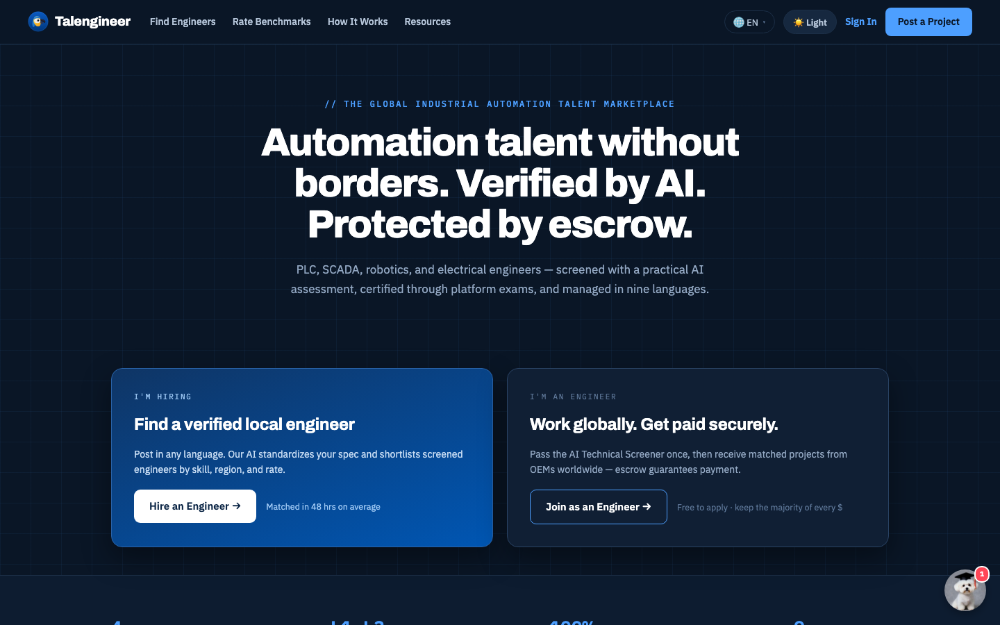
*talengineer.us 首页 —— 无国界的自动化人才：AI 认证，托管护航*

TalEngineer 是工业自动化领域的工程师撮合与交付平台，连接两类人：

- **雇主**：在墨西哥/越南/泰国建厂的中国出海企业，以及需要控制工程师的美国制造商；
- **工程师**：全球的 PLC、机器人、机器视觉、电气工程师。

平台的三根支柱：

| 支柱 | 解决什么 | 怎么做 |
|---|---|---|
| **平台认证** | "这人行不行" | 4 大方向 × L1-L3 等级考证：AI 出题限时考核 + 平台人工复核发证；持证才能被指派上单 |
| **资金托管** | "钱给了怕打水漂" | 雇主按里程碑把钱托管到 Stripe，工程师交付、雇主验收后才放款；出纠纷平台裁决，可原路退款 |
| **双向透明** | "信息不对称" | 双向评价、TalScore 质量分、费用比例全公开、工程师到手金额下单前就能看到 |

**诚实边界（请一定读完）**：平台处于 Beta 期。你在页面上看到带 **「🧪 测试数据 · Demo」徽标**的内容是演示样例（真实数据一旦产生会自动替换）；不带徽标的都是真实数据。我们不把演示数据冒充真实业绩。

---

## 二、5 分钟快速上手

### 雇主：从发需求到放款

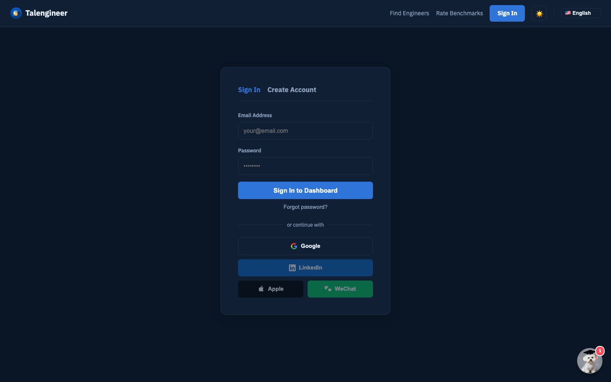
*注册 / 登录入口 —— 支持邮箱注册与 Google 登录*

1. **注册**：talengineer.us/talent → Create Account，选「雇主」。注册后请查收验证邮件并点击确认（48 小时内有效，可在控制台重发）。
2. **发布需求**：用**任意语言**描述项目（中文也行），点「✨ AI 解析」自动生成标准化需求书与里程碑拆分；可选勾选**自动邀请**（让平台按认证方向、TalScore、区域、费率上限自动邀请最多 5 位持证工程师来申请）。
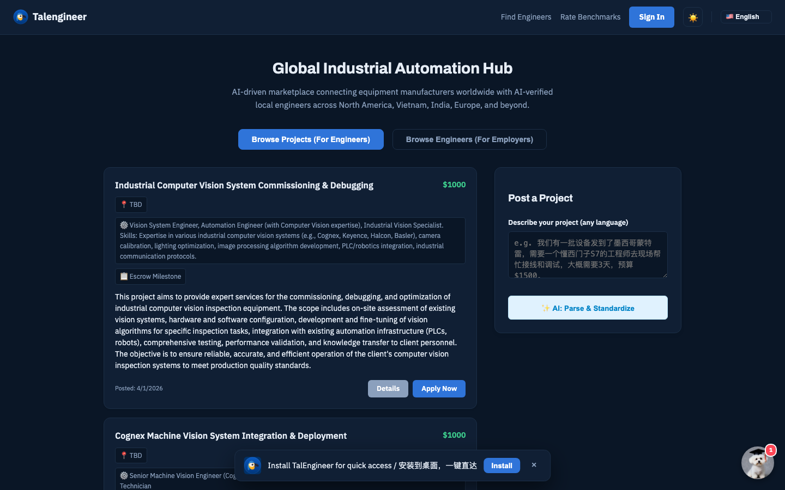
*发布项目 —— 任意语言描述，AI 自动解析成标准需求书*

3. **选人并指派**：在申请列表查看工程师的认证徽章、TalScore、评价；点「指派」（注意：**只有持有效平台认证的工程师才能被指派**——这是硬门禁）。
4. **托管资金**：进入 Finance（或控制台「托管与支付」），给里程碑点「Fund」→ Stripe 收银台付款 → 资金进入托管，工程师收到开工通知。
5. **验收与放款**：工程师提交完工（含现场照片）后你会收到通知；确认无误点「通过并放款」，资金扣除平台费后转给工程师。之后别忘了给工程师留个评价。

### 工程师：从注册到收款

1. **注册**：选「工程师」，完成 AI 技术筛选问答（得分计入你的档案，是撮合排序的重要信号）。同样需要邮箱验证。
2. **完善档案**（My Profile）：上传头像与作品集（支持直接传图）、填技能与费率；建议同时上传**保险 COI**（平台人工核验后在你主页展示"已核验"）和 **W-9 税表**（美国报税用，存私有加密空间，绝不公开）。
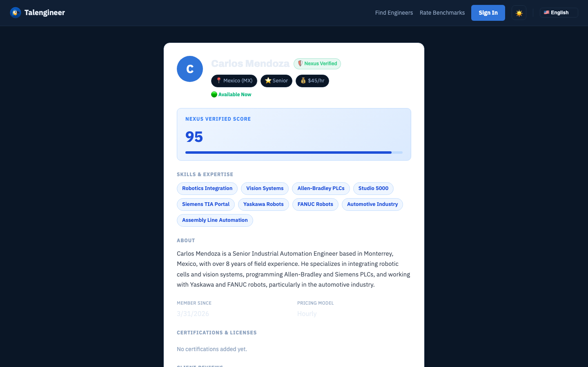
*工程师公开主页 —— 技能、认证、评价、作品集一站展示*

3. **考证**（认证中心 /training）：选方向（PLC / 机器人 / 视觉 / 电气）→ AI 学习路径 → 限时考核（10 题混合卷：5 选择 + 3 场景 + 2 分析，40 分钟，70 分及格）→ AI 评分 + **平台人工复核**后发证。没过 7 天后可重考。**持证是被指派的前提。**
4. **接单**：浏览项目主动申请，或等待平台自动邀请（站内信+邮件）。被指派后等雇主托管资金。
5. **干活**：资金托管后，到现场在工单页 **GPS 签到** → 完工后拍照上传、填写完工说明 → 提交等待雇主验收。
6. **收款**：雇主放款后，美元经 Stripe 1-2 个工作日到账（可在 Finance 页绑定 Stripe 收款账户；符合资格可用**即时提现**，Stripe 收 1% 手续费）。不在 Stripe 覆盖地区的工程师走**平台线下打款**通道（放款后平台登记，线下转账并留凭证）。收款后记得**评价雇主**。

---

## 三、核心概念

### 里程碑与托管（钱的一生）

每个项目拆成若干**里程碑**，每个里程碑的钱独立走完整流程：

**待托管** →（雇主付款）→ **已托管** →（工程师签到干活、提交完工）→ **待验收** →（雇主通过）→ **已放款**

任何一步出问题都可以**开纠纷**：里程碑冻结，双方各有 **5 天举证期**（双方都会收到站内+邮件通知），平台审理后裁决——全额给工程师 / 全额退回雇主（**原路退款**，平台不抽费）/ 按比例分账。

### 平台认证 ≠ 简历自报

档案里工程师自己写的技能只是参考；**平台认证**是真刀真枪考出来的（AI 出题 + 限时 + 人工复核），并且是指派的硬门禁。雇主看到认证徽章时，可以放心它背后有考核记录。

### TalScore 质量分（0-100，四档徽章）

综合四个维度自动计算：AI 技术筛选分（25%）+ 平台认证（25%）+ 历史评价（30%，小样本自动收缩防"一条好评刷满分"）+ 可靠性（20%，完单数与纠纷率）。分档：**Platinum ≥85 · Gold ≥70 · Silver ≥55 · Bronze <55**。每次完单、评价、纠纷后自动更新。

### 费用（全公开）

平台服务费默认 **15%**，从放款时的工程师侧扣除；发单页会直接显示"工程师到手金额"。**Founding 客户计划：前 5 单平台费 5%**（联系平台开通）。

### 语言与主题

全站支持 **9 种语言**（英/中/西/越/印地/法/德/日/韩，导航栏切换）和**深浅色主题**（🌙/☀️ 按钮）。控制台与深度页面当前以中英为主，其余语言逐步补齐。

---

## 四、功能详解

### 4.1 控制台（登录后主界面 /console）

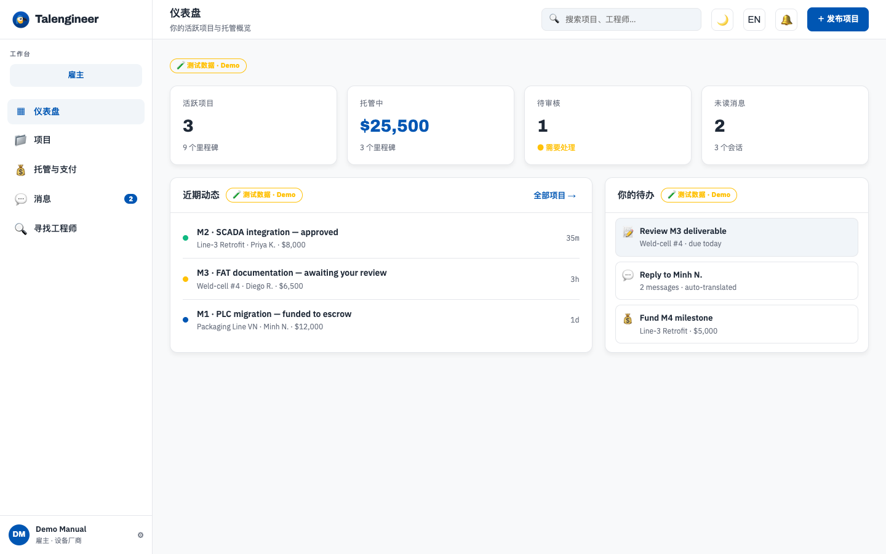
*控制台 · 仪表盘 —— 活跃项目、托管金额、动态与待办一目了然（带 🧪 徽标的是演示数据）*

左侧栏六大区：**仪表盘**（活动流+待办清单，待办从真实数据推导：该托管的、该验收的、该签到的、该考证的）、**项目**（里程碑时间线，按角色显示操作：雇主见"通过并放款"，工程师见"提交完工·申请付款"）、**托管与支付**、**消息**、**寻找工程师**（雇主）/ **档案与认证 + 学习与考核**（工程师）。右上角：搜索、主题切换、语言切换、**通知铃铛**（点开是通知面板，支持一键全部已读）。

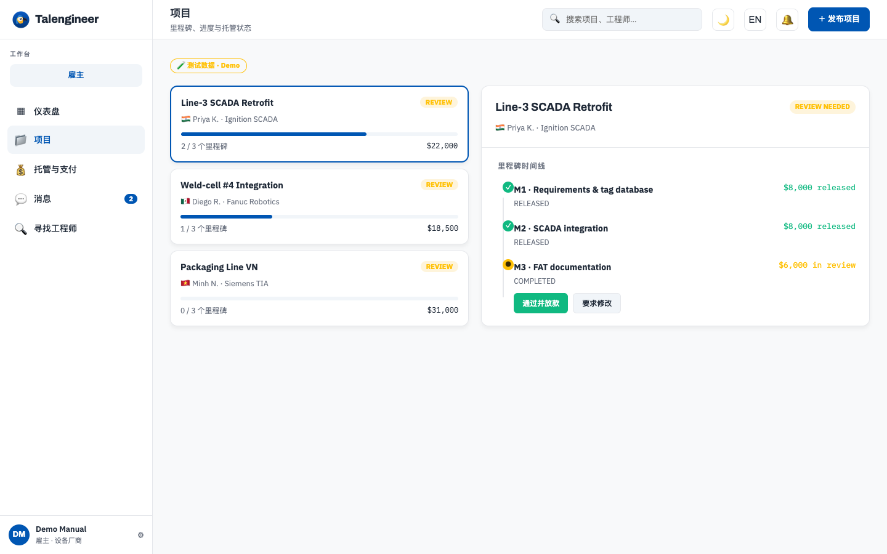
*控制台 · 项目 —— 里程碑时间线与角色化操作按钮*

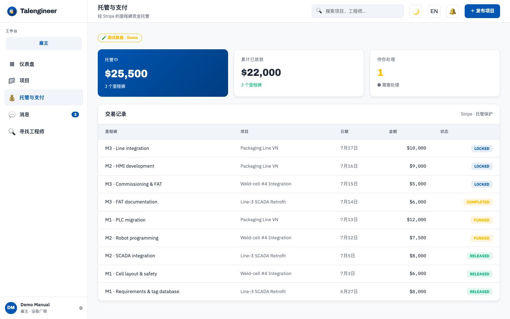
*控制台 · 托管与支付 —— 托管金额、已放款与交易明细*

### 4.2 发布需求与自动邀请（雇主）

/talent 页「发布项目」：任意语言描述 → AI 解析成标准需求书+里程碑。可选**要求认证方向**（只有该方向持证者可被指派）与**自动邀请**（设最低 TalScore / 区域 / 费率上限 / 邀请人数 ≤5，平台自动通知匹配的持证工程师）。自动邀请只是"邀请申请"，**指派永远由你人工确认**。

### 4.3 工单与现场交付（工程师）

被指派且资金托管后，工单页（/workorder/…）提供：**GPS 签到**（记录到场）、**完工照片上传**、完工说明提交；雇主验收后可下载**工单 PDF**（含双方信息、金额、签字栏，可打印存档）。

### 4.4 消息与战情室

- **项目消息**（/messages）：与对方的项目内私信，站内实时；若对方不在线，新一轮对话的第一条会补发**邮件提醒**（不轰炸）。
- **战情室**（/warroom）：实时聊天 + **AI 自动翻译**（中文雇主与西语/英语工程师各说各话、各看各文），另有 AI 日报与质检照片分析。

### 4.5 评价与信誉

交易结算后双向评价：雇主评工程师（进 TalScore 与主页），工程师评雇主（在项目页展示雇主评分）。**只有真实成交的当事人才能评价**——平台校验"是本单雇主/被指派工程师 + 至少一个里程碑已结算"，杜绝刷评。

### 4.6 收款设置（工程师）

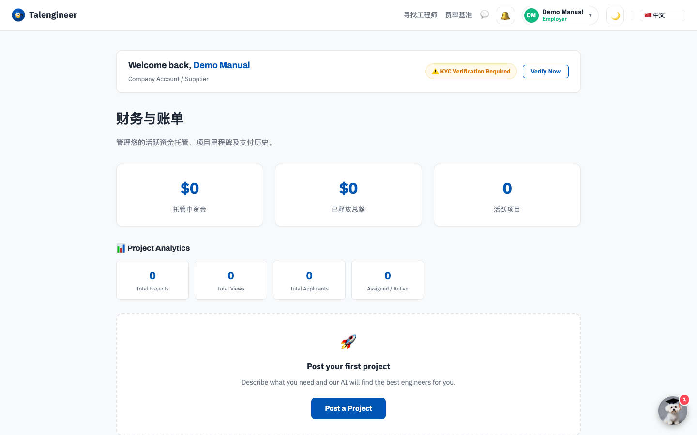
*Finance —— 托管总览、里程碑操作与收款设置*

Finance 页绑定 **Stripe 收款账户**（Express，一次设置）；账户激活后能看到**余额卡**（可用/在途/可即时提现额度）与 **⚡ 即时提现**按钮（1% 手续费，资格由 Stripe 判定，不符合就走标准 1-2 个工作日）。Stripe 不覆盖的地区：联系平台切换为**线下打款**通道。

### 4.7 手机使用（PWA）

用手机浏览器打开 talengineer.us 会提示**"添加到主屏幕"**——安装后像 App 一样全屏使用，支持离线打开与**推送通知**（首次登录会请求通知权限，工地上放款/指派/纠纷消息即时可达）。

### 4.8 企业 API（技术团队）

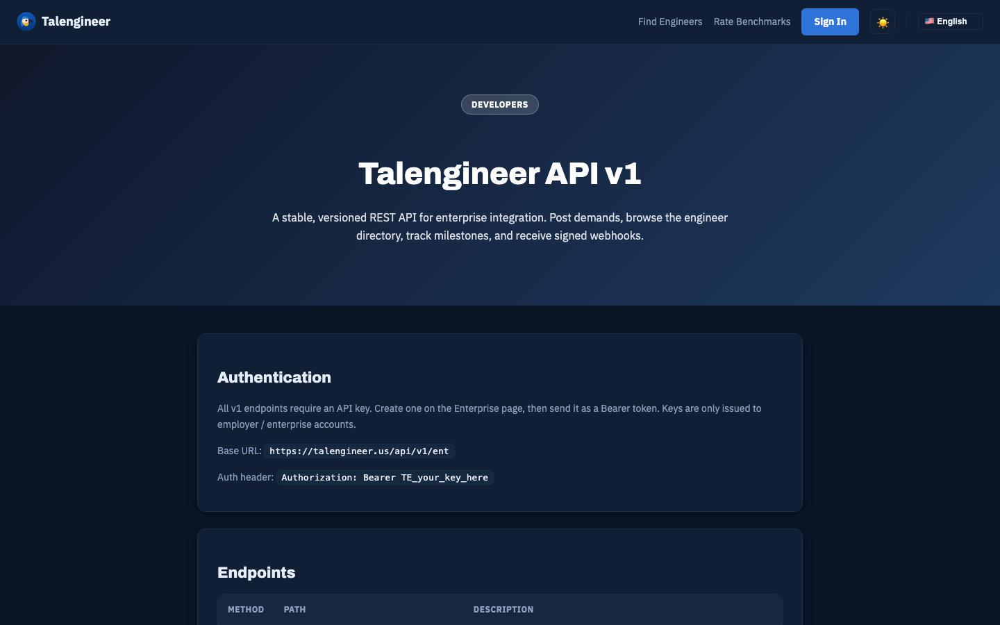
*talengineer.us/developers —— 企业 API 与 Webhook 完整文档*

有系统对接需求的企业可在 /enterprise 生成 API Key，通过 REST API 发需求、查工程师、查里程碑状态，并配置 **Webhook 回调**（托管/放款/指派事件，HMAC 签名防伪造）。完整文档见 **talengineer.us/developers**。

### 4.9 Playbook 与行业页

/playbook 有平台的实操指南文章（中英文：费率行情、雇佣清单、墨西哥/越南建厂用人等）；/hire/plc 等四个方向页介绍各方向的认证体系与费率区间。

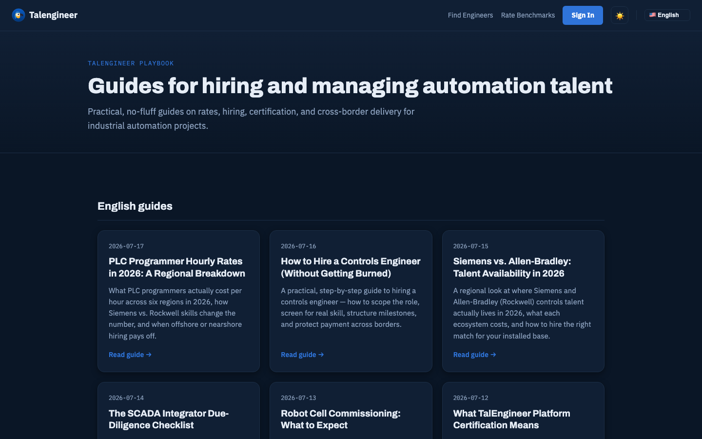
*Playbook —— 中英文实操指南文章库*

---

## 五、费用与结算速查

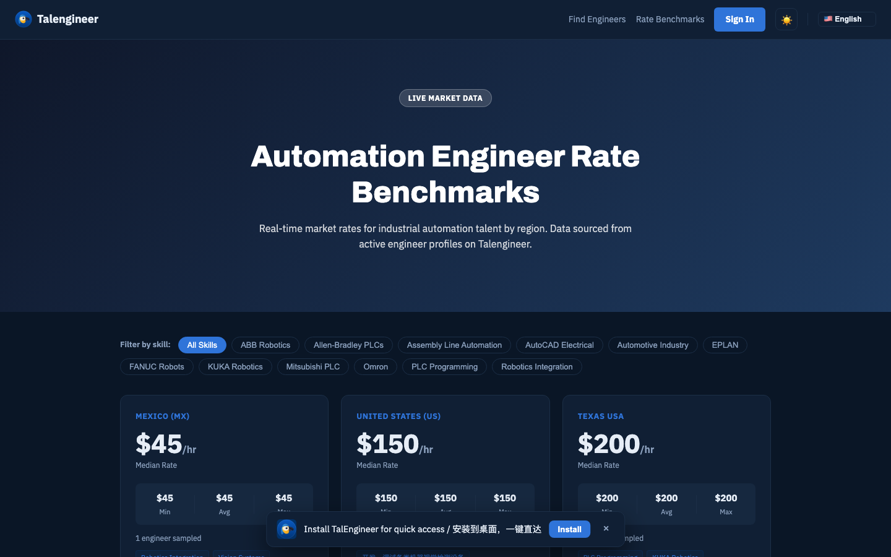
*Rate Benchmarks —— 各方向公开费率基准（talengineer.us/rates）*

| 项目 | 说明 |
|---|---|
| 雇主付款 | 按里程碑托管，Stripe 收银台（支持国际卡） |
| 平台服务费 | 默认 15%（放款时从工程师侧扣）；Founding 前 5 单 5% |
| 工程师到账 | Stripe 标准 1-2 个工作日；即时提现 1% 手续费；线下打款通道另议 |
| 纠纷退款 | 判退雇主时**原路退回付款卡**，平台不抽费 |
| 税务 | 美国工程师：平台采集 W-9（私有加密存储），年度 1099 经 Stripe 出具 |

---

## 六、常见问题

**Q：注册后没收到验证邮件？**
查垃圾箱；仍没有就登录后在提示条点"重发验证邮件"。

**Q：考试没通过怎么办？**
7 天冷却后可重考。学习路径里的课程和练习可以无限次刷。

**Q：为什么我不能被指派？**
被指派需要持有效平台认证（若需求指定了方向，需持该方向的证）。先去认证中心考证。

**Q：钱托管了但工程师一直不干活？**
在里程碑处开纠纷：里程碑立即冻结，5 天举证期后平台裁决，可全额退回你的付款卡。

**Q：雇主一直不验收怎么办？**
先在项目消息里催告；无回应可开纠纷，把完工照片和记录作为证据提交。

**Q：页面上带 🧪 标的数字是真的吗？**
不是。带「🧪 测试数据」徽标的都是演示样例，仅用于展示界面形态；真实数据产生后自动替换。

**Q：手机上能用吗？**
能。浏览器直接用，或"添加到主屏幕"当 App 用（支持推送通知）。

**Q：如何拿到 Founding 5% 费率？**
Beta 期前 5 个成交雇主专享，发邮件或在任意页面联系我们开通。

**Q：支持哪些语言？**
界面 9 种语言；战情室聊天自动翻译，双方各看各的语言。

**Q：我不在美国，怎么收款？**
Stripe 覆盖地区直接绑 Stripe；不覆盖的（部分拉美/东南亚）联系平台开通线下打款通道，放款后平台登记并线下转账、凭证可查。

---

## 七、隐私与数据

- **W-9 等税务文件**存放在私有加密空间，仅平台管理员经限时签名链接可查，绝不公开、绝不进搜索。
- **联系方式**（邮箱）仅用于交易通知与验证，公开档案不展示邮箱。
- **评价**公开展示但仅限真实交易当事人可写。
- 需要删除账户或导出数据，联系 hello@talengineer.us。

---

## 八、获取帮助

- 邮箱：**hello@talengineer.us**
- 实操指南：**talengineer.us/playbook**
- API 文档：**talengineer.us/developers**
- Beta 期反馈：任何问题直接回邮件，创始团队亲自处理。

---

*TalEngineer · Certified Industrial Automation Engineers, On Demand · v1.0 (2026-07-18)*
